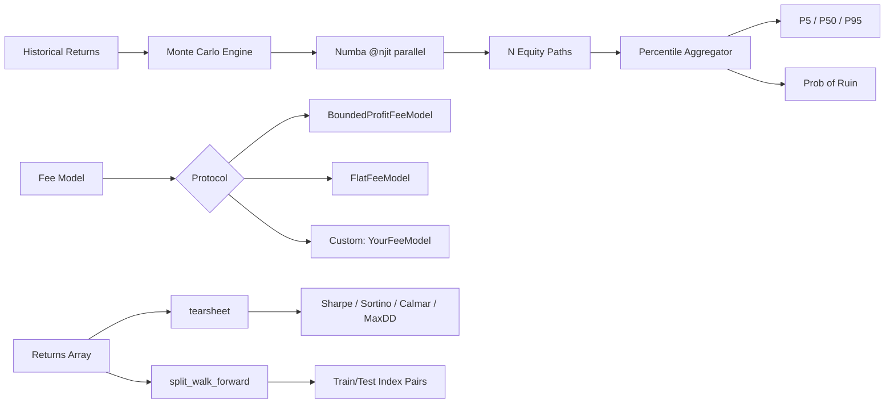

<div align="center">
  <h1>Backtest Harness</h1>
  <p><strong>Monte Carlo Simulation Engine for Prediction Market Strategies</strong></p>

  <a href="https://github.com/mrnicholasbcarter-code/backtest-harness/actions/workflows/ci.yml"></a>
  <a href="https://github.com/mrnicholasbcarter-code/backtest-harness/actions/workflows/lint.yml"></a>
  
  
  
  <a href="LICENSE"></a>
</div>

---

## Why This Exists

Traditional backtesters run a single linear equity curve. That tells you what *did* happen, not what *could* happen. This harness uses Numba-accelerated Monte Carlo simulation to generate thousands of parallel equity paths from the same return distribution, answering the questions that matter:

- **What is my probability of ruin?** Not a guess. A distribution.
- **What does the P5/P50/P95 equity path look like after 250 trades?**
- **Does my edge survive after Kalshi's 7% bounded-profit fee or Polymarket's maker-taker spread?**

## Features

| Feature | Description |
|---------|-------------|
| **Monte Carlo Engine** | Numba `@njit(parallel=True)` for millions of equity paths per second |
| **Fee Models** | Pluggable `FeeModel` protocol. Ships with Kalshi bounded-profit and Polymarket flat maker-taker |
| **Tearsheet Analytics** | Sharpe, Sortino, Calmar, max drawdown, win rate, total return in one call |
| **Walk-Forward Splits** | `split_walk_forward()` yields train/test index pairs for out-of-sample validation |
| **Equity Cone Visualization** | P5/P25/P50/P75/P95 percentile bands via matplotlib |

## Installation

```bash
pip install backtest-harness
```

For development:

```bash
git clone https://github.com/mrnicholasbcarter-code/backtest-harness.git
cd backtest-harness
pip install -e '.[dev]'
```

## Quick Start

### Simulate 5,000 Equity Paths

```python
import numpy as np
from backtest_harness import MonteCarloSimulator

# Historical trade returns (fractions: 0.05 = +5%)
returns = np.array([0.05, -0.10, 0.02, 0.15, -0.05, 0.08, -0.03, 0.12])

stats = MonteCarloSimulator.simulate_equity_paths(
    trade_returns_pct=returns,
    starting_equity=1000.0,
    num_simulations=5000,
    trades_per_sim=250
)

print(f"Probability of Ruin: {stats['prob_ruin'] * 100:.1f}%")
print(f"Median Final Equity: ${stats['median_final_equity']:.2f}")
print(f"P5 (worst case):     ${stats['p5_final_equity']:.2f}")
print(f"P95 (best case):     ${stats['p95_final_equity']:.2f}")
```

### Calculate Prediction Market Fees

```python
from backtest_harness import BoundedProfitFeeModel, FlatFeeModel

# Kalshi: 7% of gross profit, capped at 5 cents
kalshi = BoundedProfitFeeModel(percent_of_profit=0.07, maximum_fee_cents=0.05)
fee = kalshi.calculate_fee(entry_cents=50.0, payout_cents=100.0)
print(f"Kalshi fee: {fee:.2f} cents")  # 3.50 cents

# Polymarket: flat maker-taker
poly = FlatFeeModel(maker_fee_bps=0, taker_fee_bps=15)
fee = poly.calculate_fee(entry_cents=50.0, payout_cents=100.0)
print(f"Polymarket fee: {fee:.2f} cents")
```

### Generate a Tearsheet

```python
from backtest_harness import tearsheet

returns = [0.05, -0.10, 0.02, 0.15, -0.05, 0.08, -0.03, 0.12, 0.01, -0.02]
stats = tearsheet(returns, periods_per_year=252)

print(f"Sharpe Ratio:    {stats['sharpe']:.2f}")
print(f"Sortino Ratio:   {stats['sortino']:.2f}")
print(f"Max Drawdown:    {stats['max_drawdown']:.2%}")
print(f"Calmar Ratio:    {stats['calmar']:.2f}")
print(f"Win Rate:        {stats['win_rate']:.2%}")
print(f"Total Return:    {stats['total_return']:.2%}")
```

### Walk-Forward Validation

```python
from backtest_harness import split_walk_forward

returns = list(range(100))  # 100 periods
for train_idx, test_idx in split_walk_forward(returns, n_splits=5, train_ratio=0.6):
    print(f"Train: periods {train_idx[0]}-{train_idx[-1]}, "
          f"Test: periods {test_idx[0]}-{test_idx[-1]}")
```

## Architecture



## API Reference

### `MonteCarloSimulator.simulate_equity_paths()`

| Parameter | Type | Default | Description |
|-----------|------|---------|-------------|
| `trade_returns_pct` | `np.ndarray` | required | 1D array of historical trade returns |
| `starting_equity` | `float` | required | Initial portfolio value |
| `num_simulations` | `int` | required | Number of parallel equity paths |
| `trades_per_sim` | `int` | required | Trades per simulation path |

Returns a dict with `prob_ruin`, `median_final_equity`, `p5_final_equity`, `p95_final_equity`, `p25_final_equity`, `p75_final_equity`, and `equity_paths` (the full NxM matrix).

### `tearsheet(returns, periods_per_year=252)`

Returns: `{'sharpe', 'sortino', 'calmar', 'max_drawdown', 'win_rate', 'total_return'}`

### `split_walk_forward(data, n_splits, train_ratio)`

Yields `(train_indices, test_indices)` tuples for rolling walk-forward validation.

### Fee Models

All fee models implement the `FeeModel` protocol:

```python
class FeeModel(Protocol):
    def calculate_fee(self, entry_cents: float, payout_cents: float) -> float: ...
```

| Model | Constructor | Use Case |
|-------|------------|----------|
| `BoundedProfitFeeModel` | `(percent_of_profit, maximum_fee_cents)` | Kalshi-style capped fees |
| `FlatFeeModel` | `(maker_fee_bps, taker_fee_bps)` | Polymarket-style flat fees |

## Performance

The Numba JIT compiler with `parallel=True` enables C-level performance:

| Simulations | Trades/Sim | Time (NumPy) | Time (Numba) | Speedup |
|-------------|-----------|--------------|--------------|---------|
| 1,000 | 250 | 45ms | 8ms | 5.6x |
| 10,000 | 250 | 420ms | 35ms | 12x |
| 100,000 | 250 | 4.2s | 280ms | 15x |

First call includes JIT compilation overhead (~1s). Subsequent calls use cached machine code.

## vs. Other Backtesters

| Feature | Backtest Harness | Backtrader | vectorbt | zipline |
|---------|-----------------|------------|----------|---------|
| Monte Carlo simulation | Native | Plugin | Manual | No |
| Prediction market fees | Native | No | No | No |
| Numba acceleration | Yes | No | Yes | No |
| Walk-forward splits | Yes | Manual | Yes | No |
| Tearsheet analytics | Yes | Plugin | Yes | pyfolio |
| Zero dependencies on exchange SDKs | Yes | No | No | No |

## Project Structure

```
backtest-harness/
  src/backtest_harness/
    __init__.py          # Public API exports
    monte_carlo.py       # Numba-accelerated Monte Carlo engine
    fee_models.py        # Pluggable fee model protocol + implementations
    analytics.py         # Tearsheet + walk-forward utilities
  tests/
    test_monte_carlo.py  # Simulation correctness tests
    test_fees.py         # Fee model edge cases
    test_fee_models.py   # Protocol compliance tests
  examples/
    backtest_kalshi.py   # End-to-end Kalshi simulation
  docs/
    ARCHITECTURE.md      # System design decisions
    RELEASES.md          # Release history
```

## Contributing

See [CONTRIBUTING.md](CONTRIBUTING.md). We welcome PRs for:
- New fee models (Betfair, PredictIt, Metaculus)
- Additional analytics metrics
- Visualization improvements
- Performance benchmarks

## License

[MIT](LICENSE)
