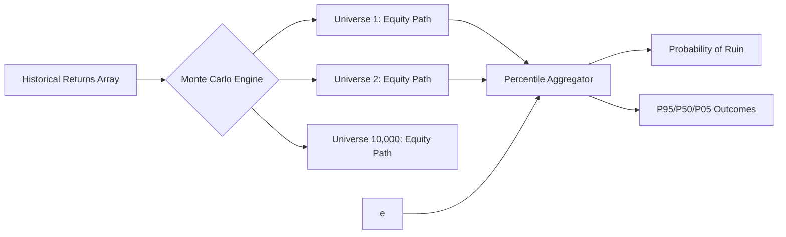

<div align="center">
  <h1>Backtest Harness</h1>
  <p><strong>Predictive Market Monte Carlo Simulator & Fee Evaluator</strong></p>
  
  
</div>

## Architecture

Traditional backtesters run linearly. This harness uses pure `numpy` matrix operations to randomly sample historical outcome distributions across millions of parallel execution paths, proving structural edge.



## Kalshi vs Polymarket Fee Modeling

This repository completely separates predictive-market fee constraints from the simulation engine. It provides O(1) evaluators for:
* **Bounded Profit Fees** (Kalshi 7% gross / 5c ceiling algorithm).
* **Flat Maker-Taker** (Polymarket orderbook).

## Quickstart
```python
import numpy as np
from backtest_harness.monte_carlo import MonteCarloSimulator

# Array of trade outcomes
historical_returns = np.array([0.05, -0.10, 0.02, 0.15, -0.05])

stats = MonteCarloSimulator.simulate_equity_paths(
    trade_returns_pct=historical_returns,
    starting_equity=1000.0,
    num_simulations=5000,
    trades_per_sim=250
)

print(f"Risk of Ruin: {stats['prob_ruin'] * 100}%")
```
