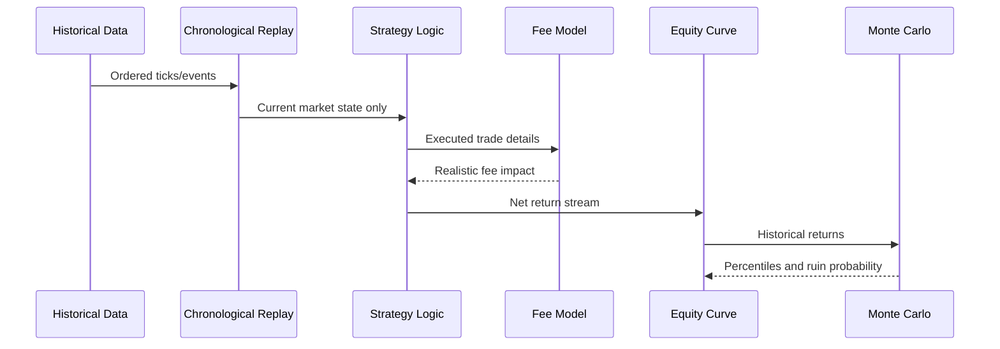
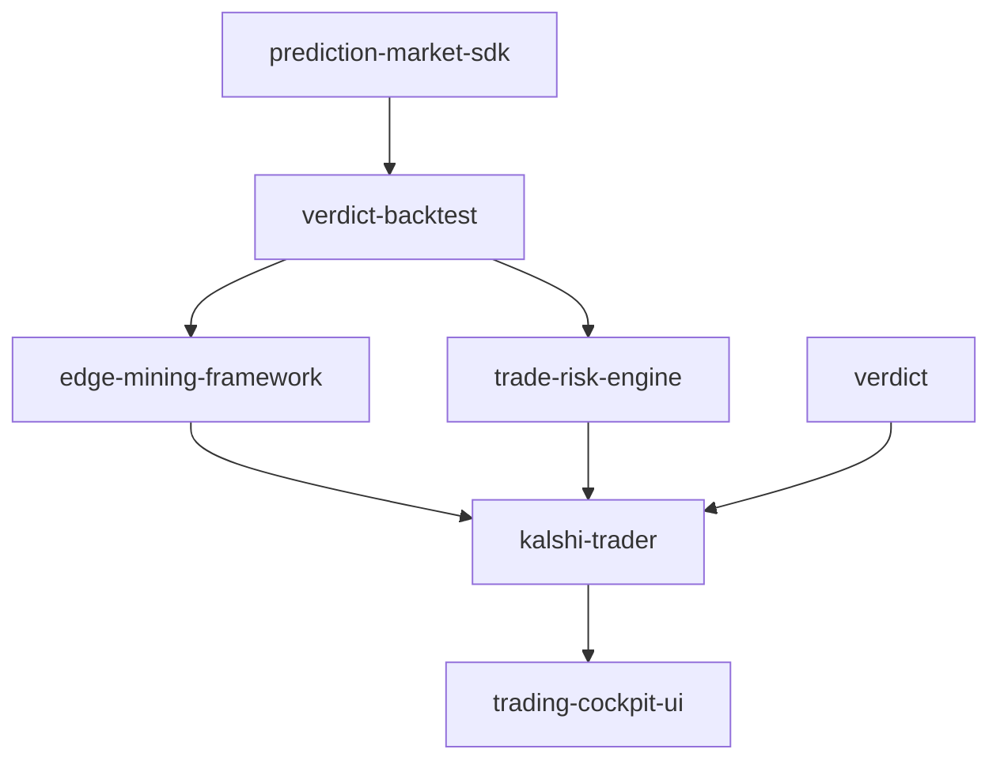

# Architecture

`verdict-backtest` provides focused primitives that can be composed by larger
trading research systems. The compatible Python import namespace is
`backtest_harness`.

## Core modules

| Module | Responsibility |
| --- | --- |
| `backtest_harness.fee_models` | Protocol and implementations for exchange fee calculations. |
| `backtest_harness.monte_carlo` | Equity-path sampling and risk percentile estimation. |

## Data flow

## Ecosystem context

## Design principles

- **Auditability over cleverness**: Backtest assumptions should be inspectable.
- **Determinism in tests**: Randomized simulations must be seeded or monkeypatched.
- **Composable boundaries**: Fee models and simulation utilities should remain easy to use independently.
- **No hidden live trading**: This package must not place orders or call broker APIs.
